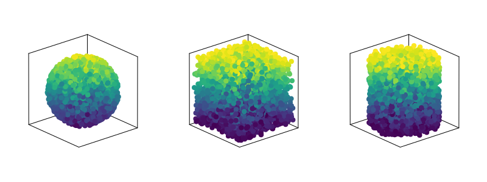

## Creating Atoms

### Default distributions

You just created cloud of atom into different geometries, the atom will be homogenously distributed inside the specified geometry. Currently, the package **only supports 3D objects**, namely `Sphere`, `Cube`, and `Cylinder`. However, the source code allows to extend functionalities to 1D and 2D in future developments - please, collaborate with a pull request. 


To create atoms, use the `Atom` constructor, the base syntax is the following

```julia
using CoupledDipoles, Random
Random.seed!(2354)
nAtoms = 5000

# `CoupledDipoles` and `CairoMakie` expoerts 'Sphere()', 
# therefore I had to be specific and write `CoupledDipoles.Sphere()`
sphere_radius = 1.5
sphere_cloud = Atom(CoupledDipoles.Sphere(), nAtoms, sphere_radius)

cube_side = 1.0
cube_cloud = Atom(Cube(), nAtoms, cube_side)

cylinder_radius = 0.5
cylinder_height = 2.0
cylinder_cloud = Atom(Cylinder(), nAtoms, cylinder_radius, cylinder_height)
```

You just created a matrix with the atoms. The atoms positions are in Cartesian Coordinates, and stored in column-major (each column correspond to an atom).


To see your atoms you need have to plot them with some external package

```julia
using CairoMakie
fig = Figure(size = (800, 300))
ax_sphere = Axis3(fig[1:2, 1:2], aspect = (1, 1, 1))
ax_cube = Axis3(fig[1:2, 3:4], aspect = (1, 1, 1))
ax_cylinder = Axis3(fig[1:2, 5:6], aspect = (1, 1, 1))

sx, sy, sz = sphere_cloud.r[1, :], sphere_cloud.r[2, :], sphere_cloud.r[3, :]
scatter!(ax_sphere, sx, sy, sz, color = sz)

cx, cy, cz = cube_cloud.r[1, :], cube_cloud.r[2, :], cube_cloud.r[3, :]
scatter!(ax_cube, cx, cy, cz, color = cz)

cyx, cyy, cyz = cylinder_cloud.r[1, :], cylinder_cloud.r[2, :], cylinder_cloud.r[3, :]
scatter!(ax_cylinder, cyx, cyy, cyz, color = cyz)

hidedecorations!(ax_sphere)
hidedecorations!(ax_cube)
hidedecorations!(ax_cylinder)
fig

save("geometries.png", fig)
```


## User defined geometry

The `Atom` constructor holds the `shape` used for multiple-dispatch on the right physical equation, `r` is the matrix containg the atomic positions, `N` is the number of atom, and `sizes` is a generic radius for the system.
```julia
struct Atom{T<:Dimension}
    shape::T
    r::Matrix{Float64}
    N::Int64
    sizes::Any
end
```

If a user wants to create their own atomic configuration, there are two constraints to consider:

1. The shape field can be handled easily by choosing one of the available options: `Sphere`, `Cube`, or `Cylinder`.
2. The matrix containing the atom positions must have each Cartesian dimension represented by a row.

Here's an example code snippet demonstrating the creation of a custom atomic configuration:
```julia
# Define atom positions as separate arrays
atom_1 = [1, 1, 1]
atom_2 = [2, 2, 2]
atom_3 = [3, 3, 3]
atom_4 = [4, 4, 4]

# Combine atom positions into a single matrix
r = transpose(vcat(atom_1, atom_2, atom_3, atom_4))
# Note: The `transpose` function is used to fulfill the matrix constraint.

# Convert the transposed result to an actual matrix using `Array`
r = Array(r)
# Note: The `transpose` operation returns a non-matrix object, so we use `Array` to materialize it.

# Create the `Atom` object with the chosen shape and custom positions
dummy_dimension = 5
atoms = Atom(Cube(), r, dummy_dimension)
```

The usage of `transpose`, followed by `Array`, is necessary to adhere to the package internals expectations.

Another example where you don't need to concatenate vectors.

```julia
# (...)
nAtoms = 5000
x = 0.5randn(nAtoms)
y = 0.5randn(nAtoms)
z = 2rand(nAtoms)
r  = hcat(x,y,z) |> transpose |> Array


dummy_radius = 0.5
dummy_height = 2.0
atoms = Atom(Cylinder(), r, dummy_radius, dummy_height)

fig = Figure(size = (450, 450))
ax_sphere = Axis3(fig[1, 1])
sx, sy, sz = atoms.r[1, :], atoms.r[2, :], atoms.r[3, :]
scatter!(ax_sphere, sx, sy, sz, color = sz)    
hidedecorations!(ax_sphere)
fig
```


---

```@docs
Sphere
```

```@docs
Cube
```

```@docs
Cylinder
```

```@docs
Atom
```