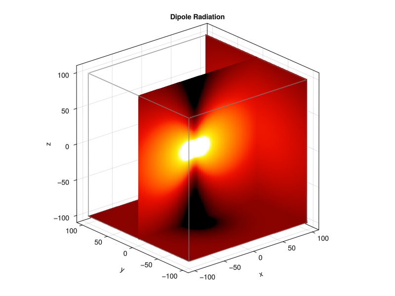
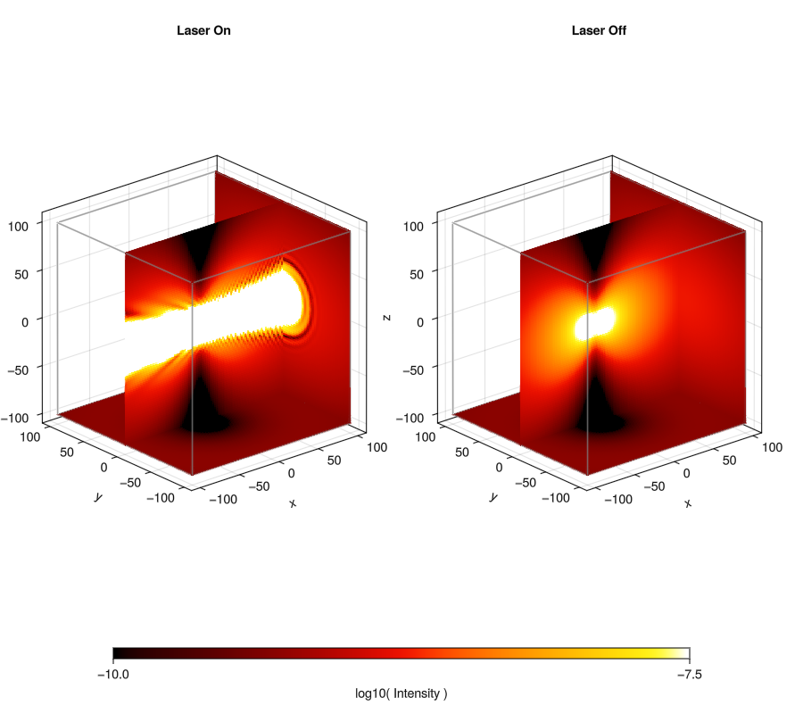

## Single Atom

The special case of a single atom is the radiation pattern of a dipole, defined in electromagnetism books.

To create a single atom system, set $N=1$ and any other function should function accordingly. Note that all functions will return a `Matrix` of 1 element. This was an intentional decision to make internal functions interoperate effectively - if all inputs were a matrix, there was no ambiguity about the number of particles.

We need to use the `Vectorial` model to best visualize the radiation pattern. The code below is a minimal working example for checking the radiation pattern through a volume slice. The laser will be pointing in the negative x-direction, to make the visualization clearer.

```julia
using CoupledDipoles, Random

# cloud settings
N = 1
kR = 10

# laser settings
w₀ = 4π
s = 1e-5
Δ = 0.0

Random.seed!(2044)
single_atom =Atom(CoupledDipoles.Cylinder(), N, kR, kR)
laser = Laser(Gaussian3D(w₀), s, Δ; direction=[-1,0,0], polarization=[0,0,1])
problem = LinearOptics(Vectorial(), single_atom, laser)
βₙ = steady_state(problem)
```

We had to apply `:near_field` regime manually to compute the intensity, because the default regime is `:far_field`. To evaulate the intensity in a certain spatial domain, we  use a list comprehension.

```julia
x = LinRange(-100, 100, 100)
y = LinRange(-100, 100, 100)
z = LinRange(-100, 100, 100)

## this plot only works for near field regime
_vol = [laser_and_scattered_intensity(problem, βₙ, Matrix([X Y Z]');regime=:near_field)[1] for X ∈ x, Y ∈ y, Z ∈ z]
laserOn = log10.(_vol)

_vol = [scattered_intensity(problem, βₙ, Matrix([X Y Z]');regime=:near_field)[1] for X ∈ x, Y ∈ y, Z ∈ z]
laserOff = log10.(_vol)
```


The package `Makie` is not a dependence of `CoupledDipoles`. Please, install it.

In the following, the figures represents the radiation in space for single atom and the color range was choosen *ad hoc* to higlight the expected dipole radiation pattern.


```julia
using ColorSchemes
using WGLMakie
WGLMakie.activate!()

## Example 1
let
    fig = Figure(resolution = (800, 600))
    ax_on = Axis3(fig[1, 1], title = "Dipole Radiation", aspect=:data)

    on_plt = volumeslices!(ax_on, x, y, z, laserOff,
        colormap=cgrad( ColorSchemes.linear_kryw_0_100_c71_n256, rev=false),
        colorrange=(-11, -9)
        )
    on_plt[:update_yz][](100)
    on_plt[:update_xz][](50)
    on_plt[:update_xy][](1)

    # save("dipole_radiation.png", fig, resolution = (800, 600))
    fig
end
```



```julia
## Example 2
let
    fig = Figure(resolution = (900, 800), background_color=:transparent)
    ax_on = Axis3(fig[1, 1], title = "Laser On", aspect=:data)
    ax_off = Axis3(fig[1, 2], title = "Laser Off", aspect=:data)

    on_plt = volumeslices!(ax_on, x, y, z, laserOn,
        colormap=cgrad( ColorSchemes.linear_kryw_0_100_c71_n256, rev=false),
        colorrange=(-11, -9)
        )
    on_plt[:update_yz][](100)
    on_plt[:update_xz][](50)
    on_plt[:update_xy][](1)

    off_plt = volumeslices!(ax_off, x, y, z, laserOff,
        colormap=cgrad( ColorSchemes.linear_kryw_0_100_c71_n256, rev=false),
        colorrange=(-11, -9)
        )
    off_plt[:update_yz][](100)
    off_plt[:update_xz][](50)
    off_plt[:update_xy][](1)

    cbar = Colorbar(fig, off_plt; label="log10( Intensity )", flipaxis=false,  vertical = false, width = Relative(4/5),ticks=WilkinsonTicks(3))
    fig[2, :] = cbar

    # save("on_off_radiation.png", fig, resolution = (800, 600))
    fig
end
```


