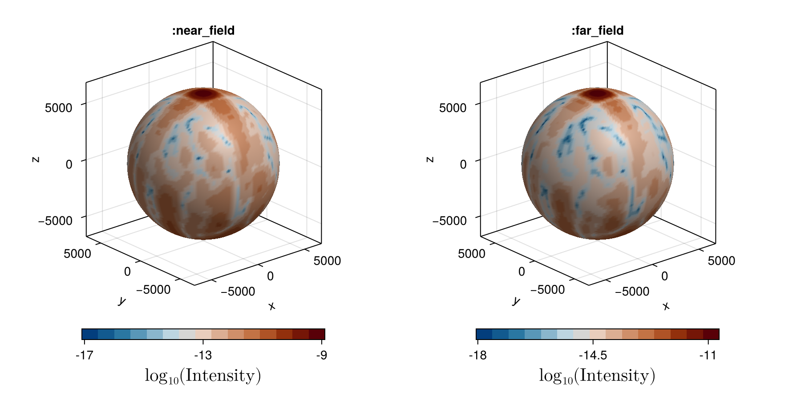

# Scattering

The electric field measured at sensor positioned at $\mathbf{R} = R\hat{n}$ results from the sum of all  dipoles located at $\mathbf{r}_j$ and their respective states $\beta_j$. The exact formula depends on the `model` and `regime`. By default, all scattering function are configured on `:near_field` regime. 

Note: **Only** the `Vectorial` Model did not have sufficient tests to be considered reliable on the `:far_field` (but is considered correct with `:near_field`)

---

## Computing Electric Field

To calculate electric field, use the provided functions `scattered_electric_field` and/or `laser_and_scattered_electric_field`.


**Important Note**: We have a precise definition for the distance `1/r` in the far-field region. While you might normalize intensity values later, making this constant less important, we still use it in our calculations. The formula for determining the far-field distance is: `how_far_is_farField(atoms) = 50*size(atoms)^2` - see the [Phd Thesis](https://doi.org/10.11606/T.76.2024.tde-26012024-114225) for the reasoning.


**Avoid creating your own calculations** for scattered fields based on formulas from articles. We use consistent mathematical constants across different simulation regimes and models. The specific formulas we employ are as follows:


### Scalar
`regime = :near_field`

$$E_{sc}(\mathbf{R}, t) = +i\frac{\Gamma}{2}\sum_j \frac{e^{ ik_0|\mathbf{R} - \mathbf{r}_j| }}{k_0|\mathbf{R} - \mathbf{r}_j|}\beta_j(t)$$

`regime = :far_field`

$$E_{sc}(\mathbf{R}, t) \approx +i\frac{\Gamma}{2} \frac{e^{ ik_0R }}{k_0R}\sum_j exp( -ik_0|\hat{n} \cdot \mathbf{r}_j| )\beta_j(t)$$

### Vectorial
`regime = :near_field`

$$E_{vec}(\mathbf{R}, t) = +i\Gamma\sum_j\sum_{\eta}G_{\mu,\eta}(\mathbf{R}-\mathbf{r}_j)\beta_j^{\eta}(t)$$

`regime = :far_field`

$$E^\mu_{vec}(\mathbf{R},t) \approx +i\frac{3\Gamma}{4} \frac{e^{ik_0R}}{k_0R}\sum_j\sum_\eta(\delta_{\mu, \eta} - \hat{n}_\mu\hat{n}_\eta^*)exp(-ik_0\hat{\mathbf{n}}\cdot\mathbf{r}_j)\beta_j^\eta(t)$$

This specific equation has **not been VALIDATED**. If you have experience with this equation, please consider contributing to the package with benchamrks.

### MeanField and Pair Correlation
The formulas for electric field in `MeanField` and `PairCorrelation` are identifical to those in `Scalar` model

`regime = :near_field|:far_field`

$$\mathbf{E}_{mf|pc} = \mathbf{E}_{sc}$$


---

## Computing Intensity

To calculate electric field intensity, use the provided functions `scattered_intensity` and/or `laser_and_scattered_intensity`.


### Scalar
`regime = :near_field|:far_field`

$$I_{sc}(\vec{R},t) = |\mathbf{E}_{sc}|^2$$

### Vectorial
`regime = :near_field|:far_field`

$$I_{vec}(\hat{n},t) = |\mathbf{E}_{vec}|^2 = \sum_\mu|E^\mu_{vec}|^2$$

### Mean Field
`regime = :near_field`

$$I_{mf}(\mathbf{R},t) = I_{sc}(\mathbf{R}, t)
+\frac{\Gamma^2}{(2k_0)^2} \left [  \sum_{j} \frac{- |\beta_j|^2    + \frac{1+\langle \sigma_j^z \rangle }{2}}{|R-r_j|^2} \right ]$$
`regime = :far_field`

$$I_{mf}(\mathbf{R},t) = I_{sc}(\mathbf{R}, t) + \frac{\Gamma^2}{(2k_0R)^2}\sum_{j=1}^N \left ( -|\beta_j|^2 + \frac{1 + \langle \sigma_j^z \rangle }{2}\right )$$

### PairCorrelation

`regime = :near_field`

$$I_{\text{PairCorrelation}} = \frac{\Gamma^2}{4 k_0^2} \left [ \sum_{j=1}^{N} \sum_{m=1, m \neq j}^{N} \left( \frac{\langle \sigma_j^+ \sigma_m^- \rangle e^{i \mathbf{k}_0 \cdot (\mathbf{r}_j - \mathbf{r}_m)}}{|\mathbf{r}_j - \mathbf{R}| |\mathbf{r}_m - \mathbf{R}|} \right) + \sum_{j=1}^{N} \left( \frac{1 + \langle \sigma_j^z \rangle }{2 |\mathbf{r}_j - \mathbf{R}|^2} \right)\right ]$$

`regime = :far_field`

$$I_{\text{PairCorrelation}} = \frac{\Gamma^2}{4 k_0^2 r^2} \left [ \sum_{j=1}^{N} \sum_{m=1, m \neq j}^{N}   \langle \sigma_j^+ \sigma_m^- \rangle e^{i \hat{n} \cdot (\mathbf{r}_j - \mathbf{r}_m)}  + \sum_{j=1}^{N}  \frac{1 + \langle \sigma_j^z \rangle}{2}  \right ]$$


**Note** that in `NonLinearOptics`, you can choose if you want or not the intensity computed with the Inelastic part of the scattering with `inelasticPart=false`.

## `:near_field` vs `:far_field`

Let's measure the scattered intensity over an sphere **around** the atomic cloud - the figure below IS NOT the cloud.

Create your problem, obtain the atomic states, and then, call `scattered_intensity`

```julia
using CoupledDipoles, Random

# --- setup problem ---
N, ρ = 3000, 25/(2π)^3
Random.seed!(100)
cloud = Atom(CoupledDipoles.Cube(), cube_inputs(N, ρ)...)

w₀, s, Δ = cloud.sizes/2, 1e-5, 0.30769230769
laser = Laser(Gaussian3D(w₀), s, Δ)

problem = LinearOptics(Scalar(), cloud, laser)
βₙ = steady_state(problem)

# --- creating sensors ---
θ = LinRange(0, π, 100)
ϕ = LinRange(0, 2π, 150)

R = 200 * size(cloud)
x = R .* [sin(θ) * sin(ϕ) for θ in θ, ϕ in ϕ]
y = R .* [sin(θ) * cos(ϕ) for θ in θ, ϕ in ϕ]
z = R .* [cos(θ) for θ in θ, ϕ in ϕ]
totalNumberPoints = length(θ) * length(ϕ)
sensors = Array([reshape(x, totalNumberPoints) reshape(y, totalNumberPoints) reshape(z, totalNumberPoints)]')

# getting light intensities
intensities_nf = scattered_intensity(problem, βₙ, sensors; regime = :near_field)
intensities_ff = scattered_intensity(problem, βₙ, sensors; regime = :far_field)
```



The source code for the figure is:

```julia
begin
	using CairoMakie, ColorSchemes, GeometryBasics, FileIO
	using Makie: get_dim, surface_normals

	function getMesh(x, y, z)
		positions = vec(
			map(CartesianIndices(z)) do i
				GeometryBasics.Point{3, Float64}(
					get_dim(x, i, 1, size(z)),
					get_dim(y, i, 2, size(z)),
					z[i],
				)
			end,
		)
		faces = decompose(GLTriangleFace, Rect2D(0.0f0, 0.0f0, 1.0f0, 1.0f0), size(z))
		normals = surface_normals(x, y, z)
		vertices = GeometryBasics.meta(positions; normals = normals)
		meshObj = GeometryBasics.Mesh(vertices, faces)
		meshObj
	end
end


begin
    cmap = cgrad(colorschemes[:vik10], 15, categorical = true)
	fig = Figure(size = (900, 450))

	subgl_left = GridLayout()
	subgl_left[1, 1] = [Axis3(fig, aspect = :data, title=":near_field",
		xlabel="x", ylabel="y", zlabel="z" ) for i in 1:1]

	subgl_right = GridLayout()
	subgl_right[1, 1] = [Axis3(fig,aspect = :data, title=":far_field",
		xlabel="x", ylabel="y", zlabel="z") for i in 1:1]

	fig.layout[1, 1] = subgl_left
	fig.layout[1, 2] = subgl_right


	pltobj_nf = mesh!(subgl_left[1,1],
		getMesh(x, y, z),
		color = log10.(intensities_nf),
		colormap = cmap,		
	)
	cbar1 = Colorbar(fig, pltobj_nf, label = L"\text{log}_{10}(\text{Intensity})",
			vertical = false, flipaxis = false, labelsize=20, width = Relative(3 / 4))
	cbar1.ticks = ([-17, -13, -9], ["-17","-13", "-9"])
	subgl_left[2,1] = cbar1


	pltobj_ff = mesh!(subgl_right[1,1],
		getMesh(x, y, z),
        color = log10.(intensities_ff),
		colormap = cmap,		
	)
	cbar2 = Colorbar(fig, pltobj_ff, label = L"\text{log}_{10}(\text{Intensity})",
			vertical = false, flipaxis = false, labelsize=20, width = Relative(3 / 4))
	cbar2.ticks = ([-18, -14.5, -11.0], ["-18","-14.5", "-11"])
	subgl_right[2,1] = cbar2

	fig
end


using FileIO
FileIO.save("intensity_near_far_fields.png", fig)
```

## Average Intensity

If you need the azimuthal average intensity, that is

$$I(\theta) = \int_0^{2\pi}|E(\theta, \phi)|^2 d\phi$$


use the function `get_intensity_over_an_angle` which is optmized to for this problem. 

Because the average integral have an exact solution, we have its implementation available, but is not recommeded to use it, since it has $O(N^2)$ in time and memory complexity - and we already verified that the default precision was reliable. In case you need more precision, decrease the tolerance of the integration with the parameter `tol`. 


---

```@docs
scattered_electric_field
```

```@docs
laser_and_scattered_intensity
```

```@docs
scattered_intensity
```

```@docs
get_intensity_over_an_angle
```
