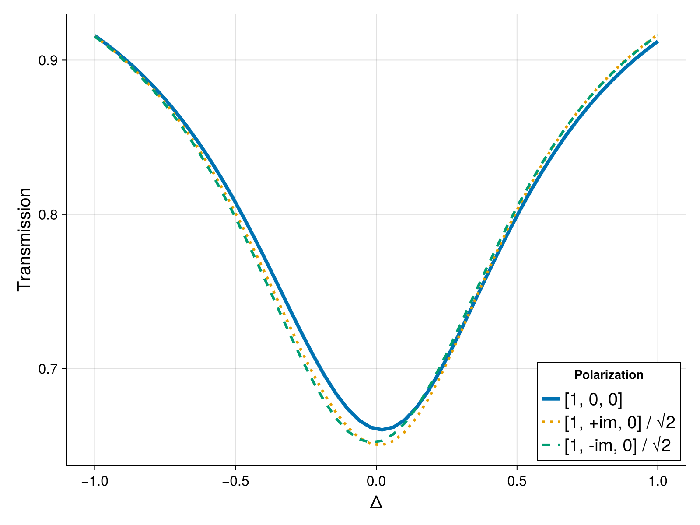

# Transmission

The transmission analysis is among the top three most challenging to implement correctly. A single incorrect constant can result in transmission values exceeding one.

The `transmission` method calculates the ratio of scattered intensity to laser intensity at a specific point (in far field distance). It requires a problem and a detuning range, from which it automatically computes the steady state.



```julia
# credits for Marcella Loyola Xavier
using CoupledDipoles, CairoMakie

# cloud settings
R, L = 17.7183099768, 8.177681527782
a, b, c = 0.1, 0.2, 0.3

X = [a, a, -a, -a] .* R
Y = [b, -b, b, -b] .* R
Z = [c, -c, -c, c] .* L
r = vcat(X', Y', Z') |> Array # atom's position matrix
dummy_dimension = R
cloud = Atom(Cube(), r, dummy_dimension)

# laser settings
w₀, s = R / 3, 1e-5
polarization_linear = [1, 0, 0]  # x-direction
polarization_circular_positive = [1, +im, 0] ./ √2 
polarization_circular_negative = [1, -im, 0] ./ √2

# transmission
begin
    Δ_range = range(-1, 1; length=50) 
    _Δ = 1.0*Δ_range[1] # for initialization purposes, I need some value

    T = zeros(length(Δ_range), 3)
    
    
    laser_lin = Laser(Gaussian3D(w₀), s, _Δ; polarization=polarization_linear)
    problem_lin = LinearOptics(Vectorial(), cloud, laser_lin)
    T[:, 1] = transmission(problem_lin, Δ_range)

    laser_cir_p = Laser(Gaussian3D(w₀), s, _Δ; polarization=polarization_circular_positive)
    problem_cir_p = LinearOptics(Vectorial(), cloud, laser_cir_p)
    T[:, 2] = transmission(problem_cir_p, Δ_range)

    laser_cir_n = Laser(Gaussian3D(w₀), s, _Δ; polarization=polarization_circular_negative)
    problem_cir_n = LinearOptics(Vectorial(), cloud, laser_cir_n)
    T[:, 3] = transmission(problem_cir_n, Δ_range)

    fig = Figure(size=(800, 600))
    ax = Axis(fig[1, 1],
        xlabel="Δ",
        ylabel="Transmission",
        xlabelsize=20,
        ylabelsize=20,
        xticklabelsize=16,
        yticklabelsize=16
    )

    lines!(ax, Δ_range, T[:, 1], label="[1, 0, 0]", linewidth=4)
    lines!(ax, Δ_range, T[:, 2], label="[1, +im, 0] / √2", linewidth=3, linestyle=:dot)
    lines!(ax, Δ_range, T[:, 3], label="[1, -im, 0] / √2", linewidth=3, linestyle=:dash)
    axislegend(ax, "Polarization", position=:rb, orientation=:vertical, labelsize=20)

    fig
end

save("transmission.png", fig)
```
---

```@docs
transmission
```
