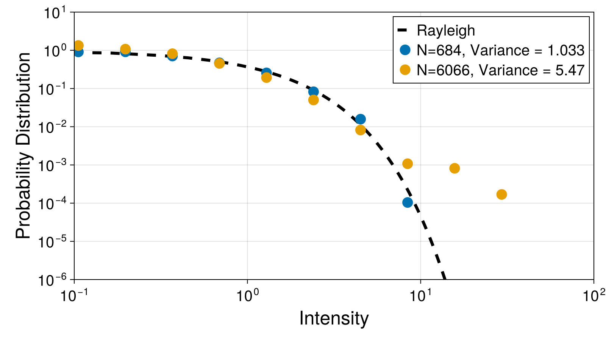

# Deviations from Rayleigh's law

Our goal is to reproduce `Figure 2` from the paper [Cottier et all, 2019](http://www.kaiserlux.de/coldatoms/Articles/Fluctuations.pdf), where the authors studied the statistics of the scattered light, and found that the **variance** of the intensity distribution deviates from the expected Rayleigh's law.

## Step 1 - Use distributed resources

This step is optional, but if you have a lot of memory of cpu cores, is a good ideia to use it.
Since this is optional, if you don't have a cluster to test, just comment the lines related to `addprocs`

```julia
using CairoMakie, LinearAlgebra
using Statistics: mean, var
using StatsBase: fit, normalize, Histogram

addprocs(2; 
    exeflags=`--project=$(Base.active_project()) --threads 4`, 
    topology=:master_worker, 
    enable_threaded_blas=true
)

@everywhere begin
    using CoupledDipoles, Random, Dagger

    function produce_intensities(rep, N, L, w₀, s, Δ, sensors)
        Random.seed!(1134 + rep)
    
        atoms = Atom(Cube(), N, L)
        laser = Laser(Gaussian3D(w₀), s, Δ)
        simulation = LinearOptics(Scalar(), atoms, laser)
    
        βₙ = steady_state(simulation)
        intensities = scattered_intensity(simulation, βₙ, sensors; regime = :far_field)
        return intensities
    end
end

```

## Step 2 - Setup Parameters
We use the exact configuration parameters from the paper. You will notice may `Warning` messages. This happen because a small laser waist leads to unreasonable results.

If you are studying Cottier's paper, note that the results from the paper are **not accurate** due to its small laser waist, even though they general paper's message is still correct.


```julia
### ------------ ATOMS SPECS ---------------------
L = 32.4
N = [684, 6066]


### ------------ LASER SPECS ---------------------
Δ = 1.0
s = 1e-6
w₀ = L / 4

### ------------ SIMULATION SPECS ---------------------
sensors = get_sensors_ring(; num_pts = 720, kR = 300, θ = 5π / 12)
maxRep = 15
```

## Step 3 - Produce Intensities

For each atom number `N`, create `maxRep` atomic configurations, compute their state states, and scattered light intensity. The normalization over the mean comes from the paper.

```julia
all_intensities = map(N) do N
    _intensities = map(1:maxRep) do rep
        Dagger.@spawn produce_intensities(rep, N, L, w₀, s, Δ, sensors)
    end

    many_intensities = fetch.(_intensities)
    many_intensities = reduce(vcat, many_intensities)
    all_intensities_over_mean = many_intensities ./ mean(many_intensities)

    all_intensities_over_mean
end;

```


## Step 4 -  Histograms

Instead of ploting `histogram` for each particle number, we are interested in the **data** from the `histogram` to display it in a `scatter` plot. Also, this is the moment to compute the variance of all intensities.


```julia
bins = 10.0 .^ range(log10(1e-6), log10(75); length = 30)

xy_data = map(eachindex(N)) do n
    h = fit(Histogram, all_intensities[n], bins)

    h_norm = normalize(h; mode = :pdf)
    bins_edges = collect(h_norm.edges[1])
    bins_centers = [sqrt(bins_edges[i] * bins_edges[i+1]) for i = 1:(length(bins_edges)-1)]
    variance = var(all_intensities[n])

    # x_data_histogram, y_data_histogram, variance
    (bins_centers, h_norm.weights, variance)
end
```


## Step 5 - Plot

Overlay the Distribution Probability in a single figure.

The `begin-end` structure is just to facilitate the Figure development for the user. It is easier to just run the block at once at every little plot tweak, than select and run everything all the time.

```julia
begin
    fig = Figure(size = (800, 450))
    ax = Axis(
        fig[1, 1],
        xlabel = "Intensity",
        ylabel = "Probability Distribution",
        title = "",
        xlabelsize = 25,
        ylabelsize = 25,
        xticklabelsize = 20,
        yticklabelsize = 20,
        xscale = log10,
        yscale = log10,
    )

    ## theoretical curve
    x_ray = range(0.01, 50; step = 0.15)
    y_ray = exp.(-x_ray)
    lines!(ax, x_ray, y_ray, linestyle = :dash, label = "Rayleigh", color = :black, linewidth = 4)

    for n = 1:2
        x = xy_data[n][1]
        y = xy_data[n][2]
        v = xy_data[n][3] # variance
        notNull = findall(y .> 0)
        scatter!(
            ax,
            x[notNull],
            y[notNull];
            label = "N=$(N[n]), Variance = $( round(v,digits=3 ))",
            marker = :circle,
            markersize = 20,
        )
    end
    ylims!(1e-6, 10)
    xlims!(1e-1, 100)
    axislegend(position = :rt, labelsize = 20)
    CairoMakie.save("rayleigh_deviation.png", fig)
    fig
end
```

